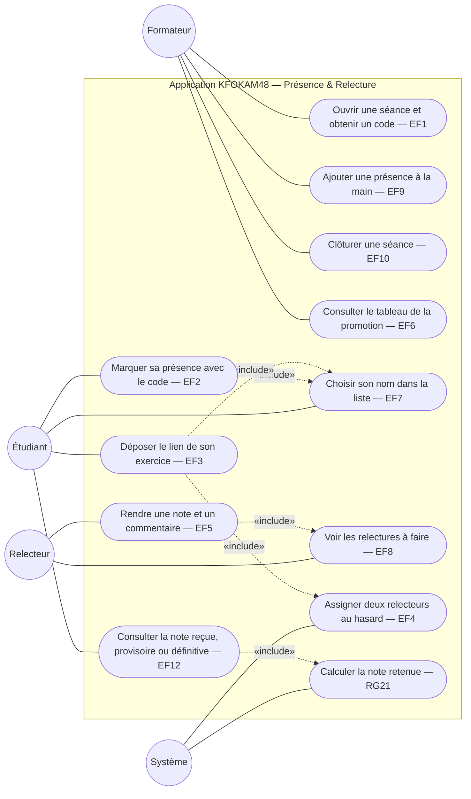

# D1 — Cas d'utilisation

Mermaid n'a pas de type « use case » natif : les acteurs sont représentés par des nœuds ronds, les cas d'utilisation par des nœuds arrondis dans le cadre du système. Les références EFx renvoient au cahier des charges.

**Version 2 (étape 3)** : deux relecteurs par exercice et note provisoire (EF4, EF12, RG21). Les cas « remplacer son lien » (EF11) et « blocage après 5 erreurs » (EF13) sont sortis du périmètre.

Note : le **Relecteur** n'est pas un compte à part. C'est un Étudiant présent à la séance que le système a désigné (RG7).
