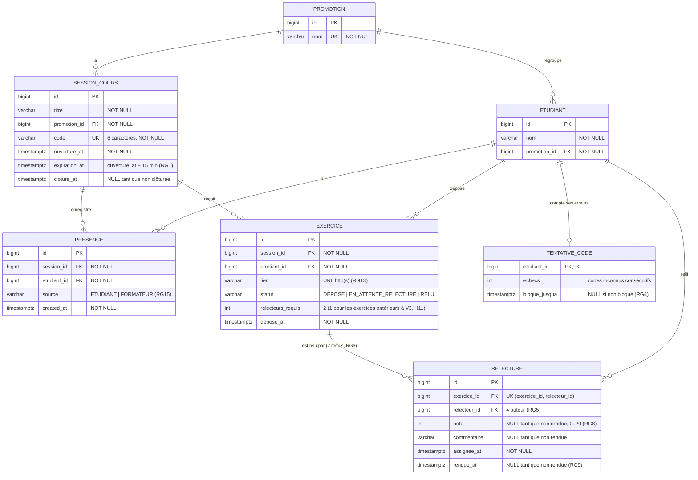

# D2 — Modèle de données

**Version 2 (étape 3)** : la migration `V3__deux_relecteurs.sql` permet deux relecteurs par exercice (RG6 modifiée) et ajoute `exercice.relecteurs_requis`.

Ce diagramme correspond **exactement** aux migrations Flyway de `backend/src/main/resources/db/migration/` : mêmes noms de tables, de colonnes et de contraintes. Toute évolution du schéma passe par une nouvelle migration **et** une mise à jour de ce fichier.

## Contraintes portées par la base

| Contrainte | Règle |
|---|---|
| `UNIQUE (session_id, etudiant_id)` sur `presence` | RG2 — une seule présence par séance |
| `UNIQUE (session_id, etudiant_id)` sur `exercice` | RG12 — un seul dépôt par séance |
| ~~`UNIQUE (exercice_id)`~~ remplacée en V3 par `UNIQUE (exercice_id, relecteur_id)` sur `relecture` | RG6 (v2) — deux relecteurs **distincts** |
| `CHECK (relecteurs_requis BETWEEN 1 AND 2)` sur `exercice` | RG6, H11 |
| `CHECK (note BETWEEN 0 AND 20)` sur `relecture` | RG8 |
| `CHECK (source IN ('ETUDIANT','FORMATEUR'))` | RG15 |
| `CHECK (statut IN ('DEPOSE','EN_ATTENTE_RELECTURE','RELU'))` | D4 |

La règle « relecteur ≠ auteur » (RG5) et la limite « au plus `relecteurs_requis` relectures » sont vérifiées dans le service, parce qu'elles portent sur deux tables. L'exercice est verrouillé (`SELECT … FOR UPDATE`) pendant l'attribution (H14).
