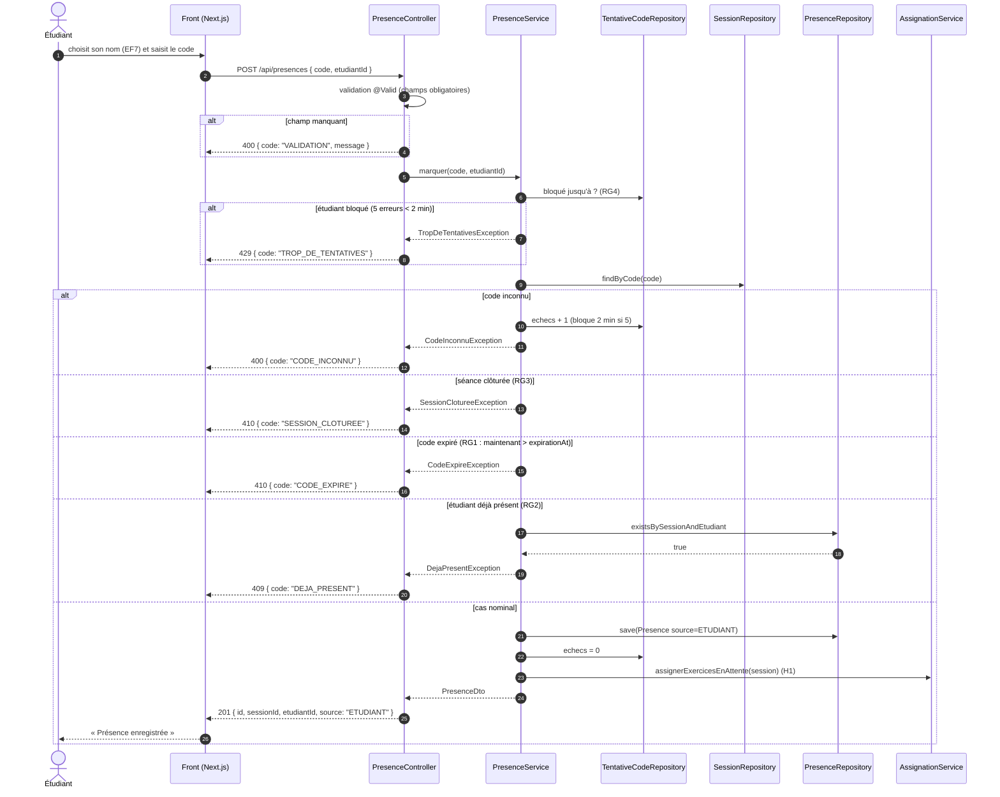

# D3 — Séquence : marquer sa présence

Les codes HTTP et les codes d'erreur sont ceux de `api/contrat.yaml`. L'ordre des vérifications dans le service est celui de ce diagramme.

Le cas « étudiant d'une autre promotion » (`403 HORS_PROMOTION`, H10) est vérifié juste avant le contrôle « déjà présent ». Il n'est pas dessiné ici pour garder le diagramme lisible.
