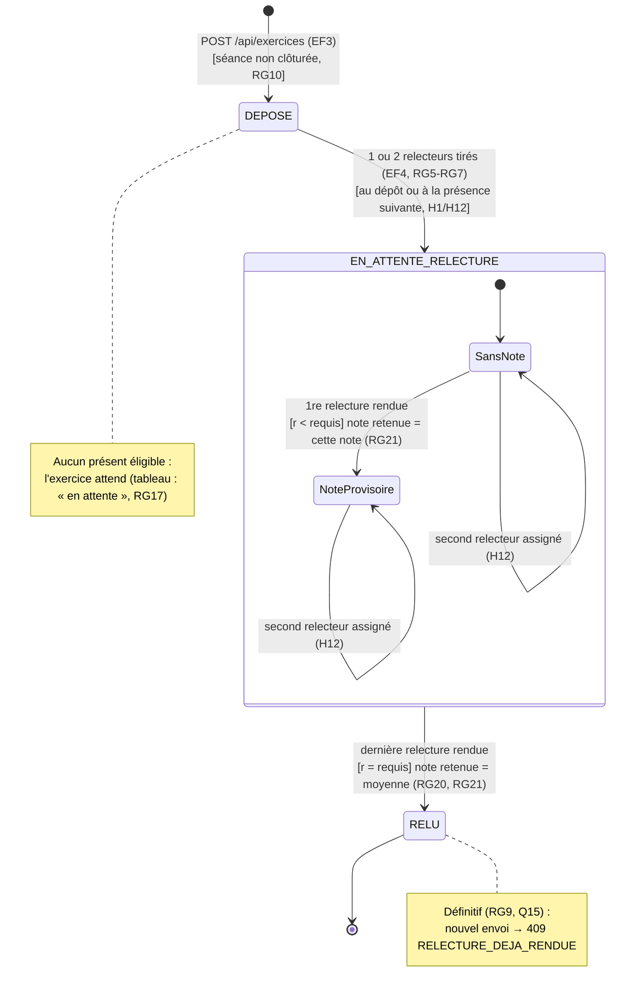

# D4 — États-transitions d'un exercice

**Version 2 (étape 3)** : deux relecteurs par exercice, note provisoire (RG6, RG20, RG21). Le remplacement du lien (RG11) est sorti du périmètre.

Valeurs de la colonne `exercice.statut` (voir D2). `n` = relectures assignées, `r` = relectures rendues, `requis` = `exercice.relecteurs_requis` (2).

`SansNote` et `NoteProvisoire` ne sont pas stockés : ils se déduisent de `r` et sont exposés par l'API via `noteProvisoire` (EF12) et `moyenneProvisoire` (EF6).
