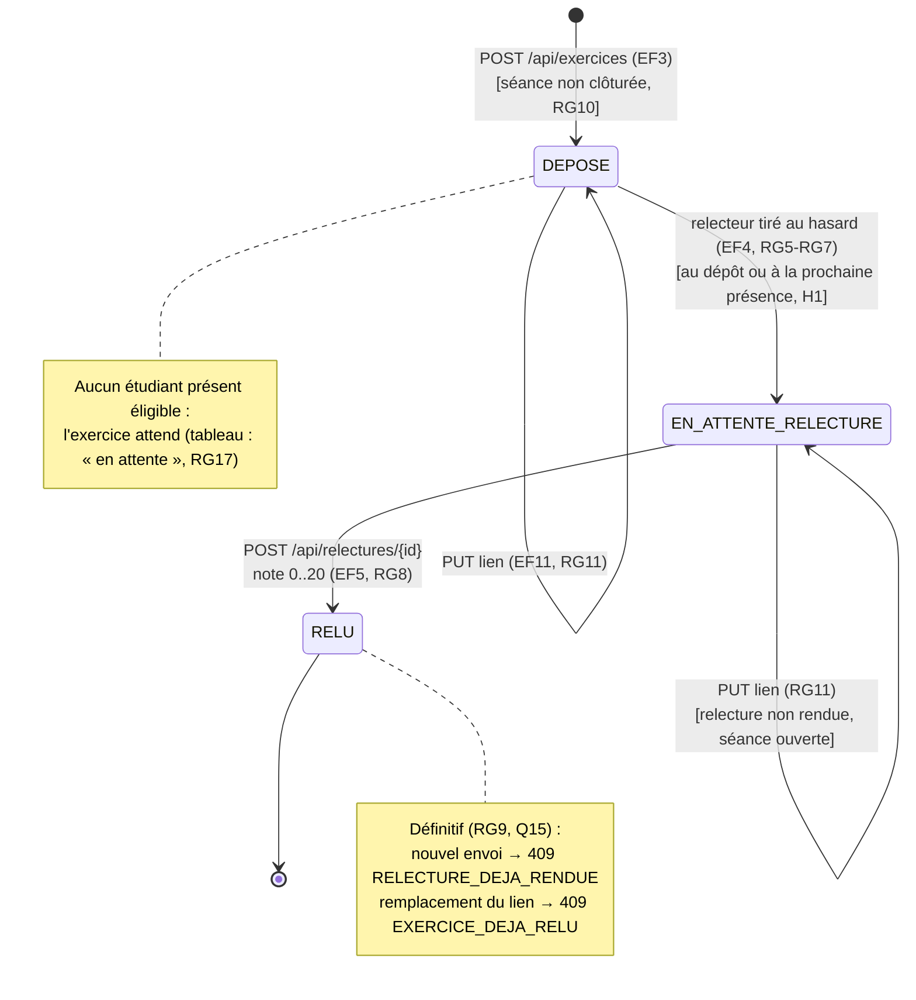

# D4 — États-transitions d'un exercice

Valeurs de la colonne `exercice.statut` (voir D2).

```mermaid
stateDiagram-v2
    [*] --> DEPOSE : POST /api/exercices (EF3)<br/>[séance non clôturée, RG10]

    DEPOSE --> EN_ATTENTE_RELECTURE : relecteur tiré au hasard (EF4, RG5-RG7)<br/>[au dépôt ou à la prochaine présence, H1]
    DEPOSE --> DEPOSE : PUT lien (EF11, RG11)

    EN_ATTENTE_RELECTURE --> EN_ATTENTE_RELECTURE : PUT lien (RG11)<br/>[relecture non rendue, séance ouverte]
    EN_ATTENTE_RELECTURE --> RELU : POST /api/relectures/{id}<br/>note 0..20 (EF5, RG8)

    RELU --> [*]

    note right of DEPOSE
        Aucun étudiant présent éligible :
        l'exercice attend (tableau : « en attente », RG17)
    end note
    note right of RELU
        Définitif (RG9, Q15) :
        nouvel envoi → 409 RELECTURE_DEJA_RENDUE
        remplacement du lien → 409 EXERCICE_DEJA_RELU
    end note
```
